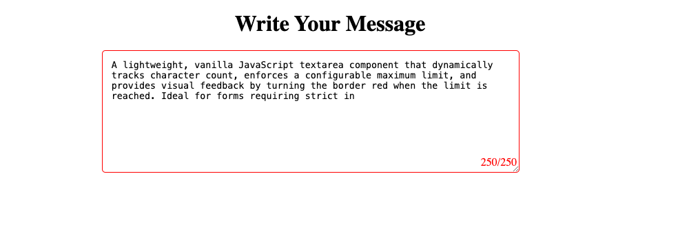

# Character-Limited Textarea with Live Counter

A simple, responsive textarea that:
- Displays real-time character count as you type
- Enforces a maximum character limit
- Prevents input beyond the limit
- Changes border color to red when the limit is reached

## Installation

1. Clone or download the repository:
   git clone https://github.com/Makundi/Restricted-Textarea.git

Project Source: https://roadmap.sh/projects/restricted-textarea

## Preview

